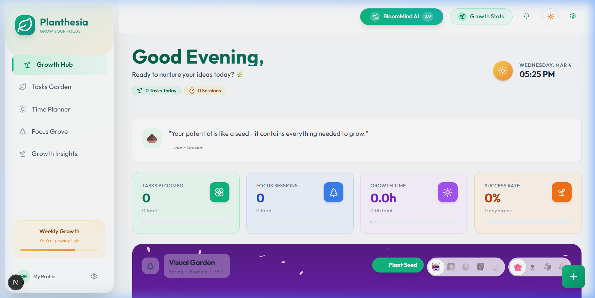

# 🌱 Planthesia: Your Productive Garden

[](https://nextjs.org/)
[](https://www.typescriptlang.org/)
[](https://tailwindcss.com/)
[](https://www.radix-ui.com/)

**Planthesia** is a unique productivity application that gamifies your daily workflow. Inspired by the tranquility of a garden, it helps you nurture your productivity by turning tasks into growth opportunities.

Powered by **Next.js**, **Tailwind CSS**, and **Google Gemini AI**, this project lets you combine powerful task management with the Pomodoro technique to help you stay focused and clear-minded.


## ✨ Features

### 🌱 Smart Task Management
Organize your life with an intuitive task board. Categorize, prioritize, and track your to-dos with ease. Watch your garden flourish as you check off items!

### 🍅 Focus Timer & Zen Mode Soundscapes
Stay in the flow with our built-in Pomodoro timer. Maximize your focus with beautifully curated ambient sounds, including **Rain, Forest, Ocean Waves, and a cozy Fireplace**. Block out distractions and work in peace.

### 📅 Daily Time-Blocking Calendar
Your schedule, structured perfectly. A fully interactive daily timeline lets you assign specific tasks to precise hours of the day (e.g., *9:00 AM - Research Project*), ensuring you run a tight and effective ship.

### 🤖 Growth AI
Your personal productivity botanist! Powered by the latest AI models (via Google Gemini), Growth AI analyzes your habits and provides personalized tips to optimize your workflow.

### ⚙️ Advanced Data Control
Own your data. Planthesia's customized settings page provides cloud-synced preferences tailored for your behavior, plus 1-click **JSON Data Exports** for all tasks, pomodoros, and history!

<div align="center">
  
</div>

## 🛠️ Technology Stack

Built with modern, robust technologies for accuracy and performance:

- **Framework**: [Next.js](https://nextjs.org/) (App Router)
- **Language**: [TypeScript](https://www.typescriptlang.org/)
- **Styling**: [Tailwind CSS](https://tailwindcss.com/) & [Radix UI](https://www.radix-ui.com/)
- **Charts**: [Recharts](https://recharts.org/)
- **Icons**: [Lucide React](https://lucide.dev/)
- **AI Integration**: [Google Gemini](https://ai.google.dev/)

## 🚀 Getting Started

Follow these steps to set up Planthesia locally on your machine.

### Prerequisites

*   Node.js (v18 or higher)
*   npm or yarn

### Installation

1.  **Clone the repository**
    ```bash
    git clone https://github.com/yourusername/planthesia.git
    cd planthesia
    ```

2.  **Install dependencies**
    ```bash
    npm install
    # or
    yarn install
    ```

3.  **Set up environment variables**
    Create a `.env.local` file in the root directory and add your Google Gemini API key:
    ```env
    GEMINI_API_KEY=your_gemini_api_key_here
    ```

4.  **Run the development server**
    ```bash
    npm run dev
    # or
    yarn dev
    ```

5.  Open [http://localhost:3000](http://localhost:3000) with your browser to see the result.

## 🤝 Contributing

Contributions are what make the open-source community such an amazing place to learn, inspire, and create. Any contributions you make are **greatly appreciated**.

1.  vFork the Project
2.  Create your Feature Branch (`git checkout -b feature/AmazingFeature`)
3.  Commit your Changes (`git commit -m 'Add some AmazingFeature'`)
4.  Push to the Branch (`git push origin feature/AmazingFeature`)
5.  Open a Pull Request

## 📄 License

Distributed under the MIT License. See `LICENSE` for more information.

---

<div align="center">
  <p>Made with ❤️ by the Planthesia Team</p>
</div>
